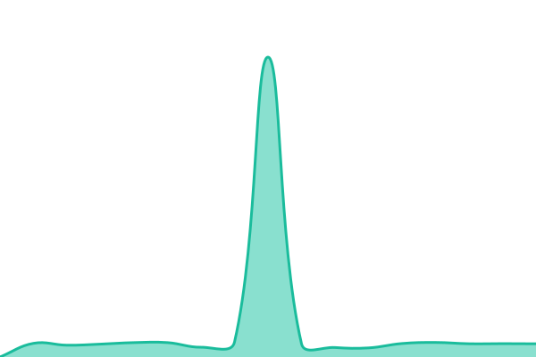

# [📈 Live Status](https://fieldbots.github.io/status): <!--live status--> **🟩 All systems operational**

This repository contains the open-source uptime monitor and status page for [FieldBots GmbH](https://fieldbots.com/), powered by [Upptime](https://github.com/upptime/upptime).

With [Upptime](https://upptime.js.org), you can get your own unlimited and free uptime monitor and status page, powered entirely by a GitHub repository. We use [Issues](https://github.com/fieldbots/status/issues) as incident reports, [Actions](https://github.com/fieldbots/status/actions) as uptime monitors, and [Pages](https://fieldbots.github.io/status) for the status page.

<!--start: status pages-->
<!-- This summary is generated by Upptime (https://github.com/upptime/upptime) -->
<!-- Do not edit this manually, your changes will be overwritten -->
<!-- prettier-ignore -->
| URL | Status | History | Response Time | Uptime |
| --- | ------ | ------- | ------------- | ------ |
|  [Biggest Fleet Website](https://biggestfleet.com) | 🟩 Up | [biggest-fleet-website.yml](https://github.com/fieldbots/status/commits/HEAD/history/biggest-fleet-website.yml) | 

 884ms
     
 | 

<a href="https://fieldbots.github.io/status/history/biggest-fleet-website">99.64%</a>
    

|  [FieldBots App](https://apps.fieldbots.com) | 🟩 Up | [field-bots-app.yml](https://github.com/fieldbots/status/commits/HEAD/history/field-bots-app.yml) | 

 661ms
     
 | 

<a href="https://fieldbots.github.io/status/history/field-bots-app">100.00%</a>
    

|  [FieldBots Connect (Europe)](https://connect.fieldbots.com) | 🟩 Up | [field-bots-connect-europe.yml](https://github.com/fieldbots/status/commits/HEAD/history/field-bots-connect-europe.yml) | 

 480ms
     
 | 

<a href="https://fieldbots.github.io/status/history/field-bots-connect-europe">100.00%</a>
    

|  [FieldBots Connect (North America)](https://connect.us.fieldbots.com) | 🟩 Up | [field-bots-connect-north-america.yml](https://github.com/fieldbots/status/commits/HEAD/history/field-bots-connect-north-america.yml) | 

 254ms
     
 | 

<a href="https://fieldbots.github.io/status/history/field-bots-connect-north-america">100.00%</a>
    

|  [FieldBots Keycloak (Auth)](https://auth.fieldbots.com/auth/realms/master) | 🟩 Up | [field-bots-keycloak-auth.yml](https://github.com/fieldbots/status/commits/HEAD/history/field-bots-keycloak-auth.yml) | 

 474ms
     
 | 

<a href="https://fieldbots.github.io/status/history/field-bots-keycloak-auth">100.00%</a>
    

|  [FieldBots Website](https://fieldbots.com) | 🟩 Up | [field-bots-website.yml](https://github.com/fieldbots/status/commits/HEAD/history/field-bots-website.yml) | 

 858ms
     
 | 

<a href="https://fieldbots.github.io/status/history/field-bots-website">99.92%</a>
    

<!--end: status pages-->

[**Visit our status website →**](https://fieldbots.github.io/status)

## 📄 License

- Powered by: [Upptime](https://github.com/upptime/upptime)
- Code: [MIT](./LICENSE) © [Anand Chowdhary](https://anandchowdhary.com)
- Data in the `./history` directory: [Open Database License](https://opendatacommons.org/licenses/odbl/1-0/)
